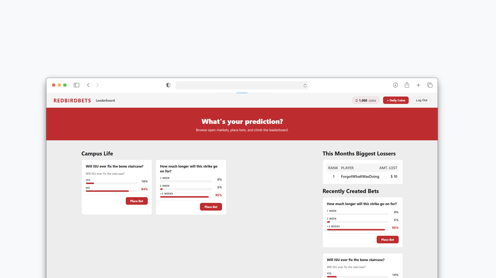

# REDBIRDBETS

> A full stack web app for **risk-free prediction markets**. Bet on real world outcomes using virtual currency, compete on the leaderboard, and have fun without the fear of losing real money.



## Features

- **Virtual Currency** - Users get a starting balance and can claim daily rewards
- **Prediction Markets** - Browse open markets, place bets on outcomes
- **Leaderboards** - Compete by balance, winnings, losses, or monthly losses
- **Admin Panel** - Create/close/resolve markets and promote users

## Build and Run From Source

### Prerequisites

- **Java 21+** — [Download](https://www.oracle.com/java/technologies/downloads/)
- **Node.js 18+** — [Download](https://nodejs.org/)
- **MySQL** — [Download](https://dev.mysql.com/downloads/)

### Backend Setup

1. **Clone the repository:**

   ```bash
   git clone https://github.com/smrive4/RedBirdBets.git
   cd RedBirdBets/backend
   ```

2. **Set up your environment variables**

   ```env
   DB_ENDPOINT=localhost
   DB_PORT=3306
   DB_NAME=predictionmarket
   DB_USER=your_mysql_username
   DB_PASS=your_mysql_password
   ```

3. **Run the backend:**
   ```bash
   ./mvnw spring-boot:run
   ```
   The API will start at `http://localhost:8080`.

### Frontend Setup

1. **Navigate to the frontend directory:**

   ```bash
   cd ../frontend
   ```

2. **Install dependencies:**

   ```bash
   npm install
   ```

3. **Start the development server:**
   ```bash
   npm run dev
   ```
   The app will be available at `http://localhost:5173`.

## Project Structure

```
RedBirdBets/
├── backend/                        # Spring Boot REST API
│   └── src/main/java/com/predictionmarket/
│       ├── controller/             # REST endpoints (Users, MarketsBets)
│       ├── model/                  # JPA entities (User, Market, Bet MarketOption)
│       ├── repository/             # Spring Data repositories
│       ├── service/                # Business logic
│       ├── security/               # Spring Security config
│       └── dto/                    # Data Transfer Objects
│
└── frontend/                       # React SPA
    └── src/
        ├── features/
        │   ├── auth/               # AuthContext & authentication state
        │   └── markets/            # Market data hooks
        ├── pages/                  # Route-level page components
        │   ├── HomePage.jsx
        │   ├── Login.jsx
        │   ├── Signup.jsx
        │   ├── Dashboard.jsx
        │   ├── LeaderboardPage.jsx
        │   └── AdminPage.jsx
        └── shared/components/      # Reusable components (ProtectedRoute, etc.)
```
